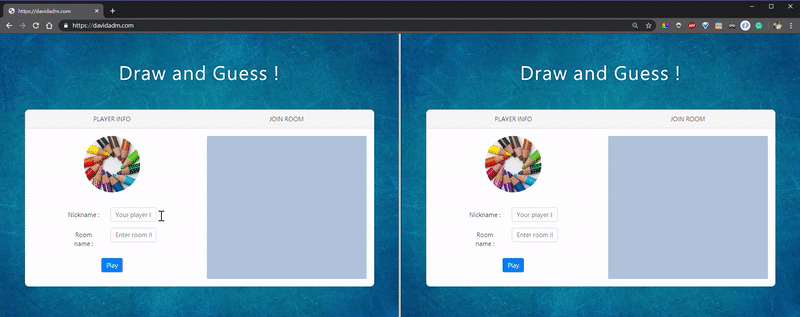

# Godoodle
Godoodle 是一個多人即時的繪畫互動遊戲平台，透過 Node.js 建構在 AWS EC2 之上。核心技術使用 [Socket.IO](#socketio) 來實現即時的遊戲互動機制，繪畫則以 Canvas 來模擬畫布行為。

[https://davidadm.com](https://davidadm.com)


## 特點
- 可任意創建遊戲房間
- 支援多人遊玩
- Real-time 呈現個別玩家的動作
- 藉由繪圖與對話聊天室進行遊戲互動
- 支援玩家中途加入遊戲
- 限時回合制
- Server-side 進行遊戲機制與邏輯處理，Client-side 進行繪圖處理，防止 Client-side 的 hack
- Event-driven programming

## 開始使用
### 創建遊戲房
進入 [https://davidadm.com](https://davidadm.com) 首頁，左側 `PLAYER INFO` 輸入任意玩家名稱與任意的房間名稱，點選 Play 即可創建遊戲房。



### 加入遊戲房
首頁右側 `JOIN ROOM` 會出現當前已存的遊戲房間，可點選該遊戲房直接加入，或是在左側 `PLAYER INFO` 輸入 Room name 並點選 Play 來加入該房間。

### 開始遊戲
第一位創建房間的玩家可以等待所有玩家進房後，點擊 `Game start` 開始遊戲，遊戲開始後會在上方出現本回合題目，該回合玩家需要在畫布上畫出題目，供其他玩家猜測。
右側為聊天室，其他玩家在聊天室當中輸入本回合猜測的答案，若答對就會得分，答錯仍然可繼續猜測，越快猜對分數越高。


## Game Object
### GameDetail
|     Field      |  Type  | Description |
| :------------: | :----: | :----------- |
|    orderNum    | Number | 當前回合數  |
| correctClients | Array  | 當前回合猜對的所有玩家 `socket.id`    |
|    correct     | Number | 當前回合猜對的玩家數   |
|   gameStatus   | String | 表示當前遊戲狀態：<br>wait / start / no-one-hit / all-correct / part-correct |
|  currentDraw   | String | 當前回合擁有繪圖權玩家的 `socket.id`  |

```javascript
class GameDetail {
    /**
     * 遊戲狀態詳細資訊
     */
    constructor() {
        this.orderNum = 0;
        this.correctClients = [];
        this.correct = 0;
        this.gameStatus = "wait";
        this.currentDraw = "";
    }
}
```
### Ranking
| Field    | Type   | Description                        |
| :--------: | :------: | :---------------------------------- |
| socketId | String | 使用者 `socket.id`                 |
| score    | Number | 目前累積得分 |
| userId   | String | 使用者 ID                          |

```javascript
/**
 * 得分
 */
class Ranking {
    /**
     * @param {string} socketId 該名使用者的 socket.id
     * @param {*} userId 該名使用者的遊戲 id
     */
    constructor(socketId, userId) {
        this.socketId = socketId;
        this.score = 0;
        this.userId = userId;
    }
}
```
### RoomDetail
| Field      | Type   | Description |
| :----------: | :------: | :----------- |
| roomId     | String | 遊戲房間 ID |
| clients    | Array | 加入房間的所有玩家 `socket.id` |
| gameDetail | Object | GameDetail 物件 |
| rankingList | Array | 所有玩家的 Ranking 物件 |

```javascript
/**
 * 各房間的詳細資訊
 */
class RoomDetail {
    /**
     * @param {string} roomId 房間 id
     */
    constructor(roomId) {
        this.roomId = roomId;
        this.clients = [];
        this.gameDetail = new GameDetail();
        this.rankingList = [];
    }
}
```
### ClientDetail
| Field      | Type   | Description |
| :----------: | :------: | :----------- |
| socketId     | String | 該使用者的 `socket.id` |
| room    | String | 該使用者所在的房間 |
| userId | String | 使用者 ID，如果沒輸入，則自動生成一個訪客 ID |

```javascript
/**
 * 使用者詳細資訊
 */
class ClientDetail {
    /**
     * @param {string} socketId 該名使用者的 socket.id
     * @param {string} roomId 該名使用者的房間 id
     * @param {string} userId 該名使用者的遊戲 id
     */
    constructor(socketId, roomId, userId) {
        this.socketId = socketId;
        this.room = roomId;
        this.userId = userId || guestAlias();
    }
}
```

## Socket.IO
### Namespace 命名空間
- `/`：用於整個網站相關的操作，如網站在線總人數。
- `/draw`：用於與遊戲機制相關的操作，如繪圖指令。


### Client-side Socket Event 列表
- #### 整體遊戲功能
  - [update-index-room-list](doc/socket_event_doc.md#update-index-room-list)
  - [online](doc/socket_event_doc.md#online)
  - [join-succeed](doc/socket_event_doc.md#join-succeed)
  - [send-chat-message](doc/socket_event_doc.md#send-chat-message)
  - [hit-correct-message](doc/socket_event_doc.md#hit-correct-message)
  - [leave-succeed](doc/socket_event_doc.md#leave-succeed)
  - [room-owner-status](doc/socket_event_doc.md#room-owner-status)
  - [toGetUpdateDataURL](doc/socket_event_doc.md#toGetUpdateDataURL)
  - [freeze](doc/socket_event_doc.md#freeze)
  - [game-run](doc/socket_event_doc.md#game-run)
  - [next-turn](doc/socket_event_doc.md#next-turn)
  - [your-turn](doc/socket_event_doc.md#your-turn)
  - [updateCurrentUser](doc/socket_event_doc.md#updateCurrentUser)
  - [send-gameStatus](doc/socket_event_doc.md#send-gameStatus)
  - [send-user-id](doc/socket_event_doc.md#send-user-id)
  - [rankingList-update](doc/socket_event_doc.md#rankingList-update)
  - [wait-next-turn](doc/socket_event_doc.md#wait-next-turn)
  - [provide-timer-process](doc/socket_event_doc.md#provide-timer-process)
  - [update-timer-process](doc/socket_event_doc.md#update-timer-process)
  - [freeze-only](doc/socket_event_doc.md#freeze-only)
  - [provide-draw-status](doc/socket_event_doc.md#provide-draw-status)
  - [update-draw-status](doc/socket_event_doc.md#update-draw-status)
- #### 繪圖功能
  - reqDataURL
  - resDataURL
  - down-draw
  - move-draw
  - leave-draw
  - enter-draw
  - change-color
  - change-line-width
  - clearBoard

### Server-side Socket Event 列表
- #### 整體遊戲功能
  - [change-user-id](doc/socket_event_doc.md#change-user-id)
  - [join-room](doc/socket_event_doc.md#join-room)
  - [send-chat-message](doc/socket_event_doc.md#send-chat-message)
  - [game-start](doc/socket_event_doc.md#game-start)
  - [send-answer-message](doc/socket_event_doc.md#send-answer-message)
  - [join-after-game-start](doc/socket_event_doc.md#join-after-game-start)
  - [return-timer-process](doc/socket_event_doc.md#return-timer-process)
  - [return-draw-status](doc/socket_event_doc.md#return-draw-status)
  - [disconnect](doc/socket_event_doc.md#disconnect)
- #### 繪圖功能
  - [reqDataURL](doc/socket_event_doc.md#reqDataURL)
  - [resDataURL](doc/socket_event_doc.md#resDataURL)
  - [down-draw](doc/socket_event_doc.md#down-draw)
  - [move-draw](doc/socket_event_doc.md#move-draw)
  - [leave-draw](doc/socket_event_doc.md#leave-draw)
  - [enter-draw](doc/socket_event_doc.md#enter-draw)
  - [change-color](doc/socket_event_doc.md#change-color)
  - [change-line-width](doc/socket_event_doc.md#change-line-width)

## Socket Event Detail
詳情請參閱 [socket_event_doc.md](doc/socket_event_doc.md)

## Unit Test 測試 Socket.IO
### 導入 module
```javascript
const expect = require("chai").expect;
const http = require("http");
const ioS = require("socket.io");
const ioC = require("socket.io-client");
const drawSocket = require("./../socket_io/draw.js");
```

### 建立測試用 Server
```javascript
/**
 * 建立 server 端
 * @return {Promise} 回傳成功連線訊息提示
 */
function createServer() {
    return new Promise((reso, rej) => {
        try {
            drawSocket(ioServer);
            reso("創建 socket server 成功!");
        } catch (err) {
            rej(err);
        }
    });
}
```
### 建立測試用 Client
```javascript
/**
 * 建立 client 端
 * @return {Promise} 回傳成功連線的 socket client 端
 */
function createClient() {
    return new Promise((reso, rej) => {
        try {
            const socket = ioC.connect(`${host}:${port}${namespace}`, {
                "reconnection delay": 0,
                "reopen delay": 0,
                "force new connection": true,
                "transports": ["websocket"]
            });
            socket.on("connect", () => {
                reso(socket);
            });
        } catch (err) {
            rej(err);
        }
    });
}
```
### 測試三個 Client 連上 Server 的情況
```javascript
/**
 * 創建 http server 與 掛上 socket.io server side
 */
before((done) => {
    console.log(">>> 創建 socket server...");
    httpServer = http.Server().listen(port);
    ioServer = ioS(httpServer);

    createServer().then((res) => {
        console.log(res);
        console.log(">>> 建立 socket.io client 端...");

        client1 = createClient();
        client2 = createClient();
        client3 = createClient();

        Promise.all([client1, client2, client3]).then((array) => {
            client1 = array[0];
            client2 = array[1];
            client3 = array[2];
            console.log("建立 socket.io client 端成功!");
            done();
        }).catch((e) => {
            console.log(e);
        });
    }).catch((e) => {
        console.log(e);
    });
});
```